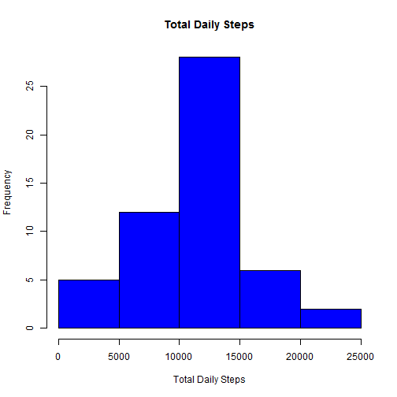
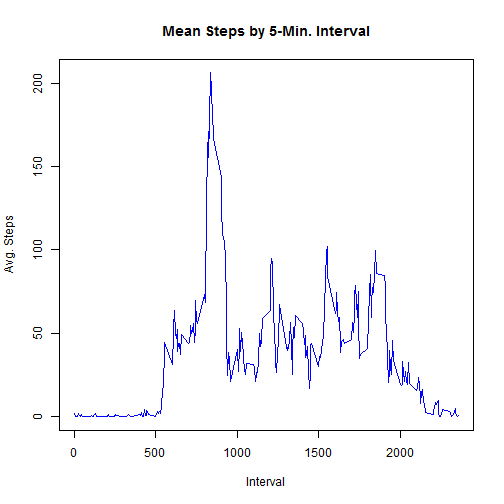
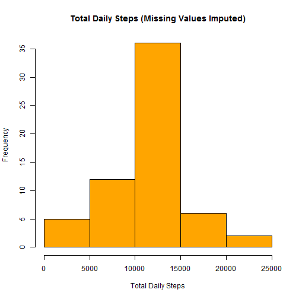
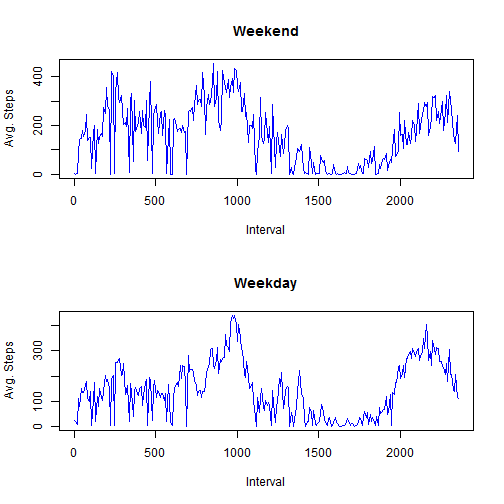

# Reproducible Research: Peer Assessment 1
This document shows the exploration and basic analysis of the activity dataset. It is assumed that the R markdown file (PA1_template.Rmd) exists within the same working directory as the file "activity.zip" provided with this assignment.

## Loading and preprocessing the data
Prior to loading the data a few functions for formatting the data are defined.
These will be reused later on in several occasions, so we define here.

### Preliminaries: Data Formatting Functions to be Used Shortly
This function takes a data frame as input and gets the total steps
for each unique date. 

```r
total_steps_by_date <- function(dataset) {
    dates <- unique(dataset$date)
    steps.date <- c()
    for (i in 1:length(dates)) {
        total <- 0
        curr <- as.numeric(subset(dataset, date == dates[i])$steps)
        for (j in 1:length(curr)) {
            total <- total + curr[j]
        }
        steps.date[i] <- total
    }
    steps.date
}
```


This takes in a data frame and get the corresponding avg. steps by unique 5-minute interval

```r
avg_steps_by_interval <- function(dataset) {
    intervals <- sort(unique(as.numeric(dataset$interval)))
    step.avg <- c()
    for (i in 1:length(intervals)) {
        curr <- as.numeric(subset(dataset, as.numeric(interval) == intervals[i])$steps)
        step.avg[i] <- mean(curr, na.rm = TRUE)
    }
    index <- 1:length(intervals)
    data.frame(cbind(interval = intervals, steps = step.avg, index))
}
```

This takes in a date in text format and returns an indicator of either Weekend or Weekday.

```r
day.classification <- function(raw.date) {
    classif <- "Weekday"
    if (is.element(weekdays(as.Date(raw.date)), c("Saturday", "Sunday"))) {
        classif <- "Weekend"
    }
    classif
}
```


### Loading the data
Below we unzip and load the data:

```r
unzip("activity.zip", overwrite = TRUE)
raw.data <- read.csv("activity.csv")
```


## What is mean total number of steps taken per day?
Here we construct a histogram and show mean/median steps. Missing values ignored in this instance.

```r
steps.by.date <- total_steps_by_date(raw.data)
hist(steps.by.date, col = "blue", xlab = "Total Daily Steps", main = "Total Daily Steps")
```

 


### Show Mean and Median Steps Per day

```r
message(paste("Mean steps per day (missing values ignored):", mean(steps.by.date, 
    na.rm = TRUE)))
```

```
## Mean steps per day (missing values ignored): 10766.1886792453
```

```r
message(paste("Median steps per day (missing values ignored):", median(steps.by.date, 
    na.rm = TRUE)))
```

```
## Median steps per day (missing values ignored): 10765
```


## What is the average daily activity pattern?
Below we construct a line graph showing the average activity by each 5-minute time interval.

```r
step.avg.by.interval <- avg_steps_by_interval(raw.data)
plot(step.avg.by.interval$interval, step.avg.by.interval$steps, type = "l", 
    xlab = "Interval", ylab = "Avg. Steps", main = "Mean Steps by 5-Min. Interval", 
    col = "blue")
```

 

### Show Interval with Most steps per Day on Average

```r
max.avg.steps <- max(step.avg.by.interval$steps)
max.steps.interval <- 0
for (i in 1:nrow(step.avg.by.interval)) {
    if (step.avg.by.interval[i, 2] == max.avg.steps) {
        max.steps.interval <- step.avg.by.interval[i, 1]
    }
}
message(paste("5-Minute interval with most steps on average:", max.steps.interval))
```

```
## 5-Minute interval with most steps on average: 835
```


## Imputing missing values
Missing step values are imputed into the dataset using a simple rule: If a row is missing step data,
the number of steos imputed is the average number of steps for its specific 5-second interval.

```r
imputed <- c()
for (i in 1:nrow(raw.data)) {
    val <- raw.data[i, 1]
    interval.index <- (i%%nrow(step.avg.by.interval)) + 1
    if (is.na(val)) {
        val <- step.avg.by.interval[interval.index, 2]
    }
    imputed[i] <- val
}
raw.data$steps <- imputed
```


### Impact of imputing data on daily metrics
Below we see that using this imputation rule increases has little impact on the mean and median daily totals:

```r
steps.by.date <- total_steps_by_date(raw.data)
hist(steps.by.date, col = "orange", xlab = "Total Daily Steps", main = "Total Daily Steps (Missing Values Imputed)")
```

 

```r
message(paste("Mean steps per day (imputed missing values):", mean(steps.by.date, 
    na.rm = TRUE)))
```

```
## Mean steps per day (imputed missing values): 10766.1886792453
```

```r
message(paste("Median steps per day (imputed missing values):", median(steps.by.date, 
    na.rm = TRUE)))
```

```
## Median steps per day (imputed missing values): 10766.1886792453
```


## Are there differences in activity patterns between weekdays and weekends?
It appears that there are differences between weekdays versus weekends. Specifically, weekends show
more activity. These differences are shown below:

```r
# Get day classifications for each day in dataset and build into a new
# dataframe:
day.classifs <- sapply(raw.data$date, function(x) day.classification(x))
steps.by.day.classif <- data.frame(cbind(day.class = day.classifs, interval = raw.data$interval, 
    steps = imputed))

# Separate out weekdays and weekends into two different sets:
wend <- avg_steps_by_interval(subset(steps.by.day.classif, day.class == "Weekend"))$steps
wday <- avg_steps_by_interval(subset(steps.by.day.classif, day.class == "Weekday"))$steps

# Plot
par(mfrow = c(2, 1))
plot(seq(1, 2355, length.out = 288), wend, type = "l", xlab = "Interval", ylab = "Avg. Steps", 
    main = "Weekend", col = "blue")
plot(seq(1, 2355, length.out = 288), wday, type = "l", xlab = "Interval", ylab = "Avg. Steps", 
    main = "Weekday", col = "blue")
```

 

