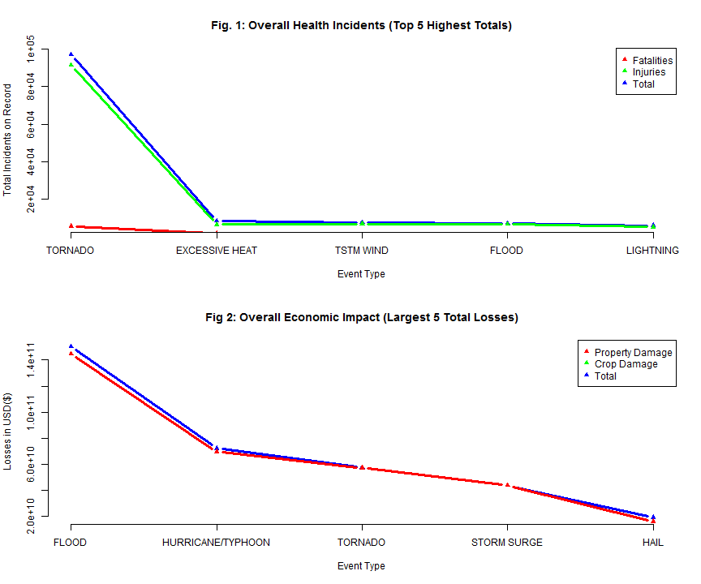

Identifying the Most Harmful Weather Event Types in the US
========================================================

This project aims to identify the top five weather event types that have cause the most harm in the US, both in terms of health as well as economic loss. The U.S. National Oceanic and Atmospheric Administration's (NOAA) storm database contains weather event incidents dating from 1950 through November 2011. This dataset is analyzed to determine total numbers of resulting health incidents and economic losses over this period for each weather type, and the resulting top five event types in each category are reported.

## Prerequisites and Assumptions

The dataset is included with this project, but can also be downloaded at:

[https://d396qusza40orc.cloudfront.net/repdata%2Fdata%2FStormData.csv.bz2](https://d396qusza40orc.cloudfront.net/repdata%2Fdata%2FStormData.csv.bz2)

It is assumed that this data file is in the same working directory as this R markdown file.

## Data Processing 

The first step in the data processing is to read in the raw data set from the **original .csv.bz2 file**:


```r
raw.data <- subset(read.csv("repdata_data_StormData.csv.bz2", header = TRUE), 
    !is.na(EVTYPE))
```


Now we extract out the unique set of weather events, and for each one get 1) the overall number of health-related measures, and 2) the the overall economic loss measures. We use the following measures for each event type taken over the entire database time period:

**Health measures for each weather event type:**
* Total number of injuries over period (taken from INJURIES column)
* Total number fatalities over period (taken from FATAILITIES column)
* Total number of incidents (= injuries + fatalities)

**Economic loss measures for each weather event type:**
* Total property damage (in USD) over period (taken from PROPDMG together with PROPDMGEXP column)
* Total crop damage (in USD) over period (taken from CROPDMG column together with PROPDMGEXP column)
* Total loss (=property damage + crop damage)

For the property and crop damages, the exponent fields (e.g. PROPDMGEXP and CROPDMGEXP) were used to multiply the corresponding base numeric values (from PROPDMG and CROPDMG columns, respectively). Only the following exponent types were recognized (the rest were simply ignored):
* k or K (= X 1,000)
* m or M (= X 1,000,000)
* b or B (= X 1,000,000,000)
* All other values = X 1

These data measures are extracted from the raw data as follows:


```r
# This function takes a magnitude (PROPDMGEXP or CROPDMGEXP column value)
# with a numeric value and performs the conversion. Recoginized formats are
# k, K, m, M, b, and B. Others are ignored.
at.mag <- function(num, mag) {
    if (is.na(num)) {
        num <- 0
    }
    if (is.element(as.factor(mag), as.factor(c("k", "K")))) {
        num <- num * 1000
    } else if (is.element(as.factor(mag), as.factor(c("m", "M")))) {
        num <- num * 1e+06
    } else if (is.element(as.factor(mag), as.factor(c("b", "B")))) {
        num <- num * 1e+09
    }
    num
}

injuries <- c()
fatalities <- c()
totalhealth <- c()
propdam <- c()
cropdam <- c()
totalcost <- c()
events <- unique(raw.data$EVTYPE)

for (i in 1:length(events)) {
    curr <- subset(raw.data, as.character(EVTYPE) == as.character(events[i]))
    injuries[i] <- sum(as.numeric(curr$INJURIES), na.rm = TRUE)
    fatalities[i] <- sum(as.numeric(curr$FATALITIES), na.rm = TRUE)
    totalhealth[i] <- injuries[i] + fatalities[i]
    propdam[i] <- sum(sapply(1:nrow(curr), function(j) at.mag(curr$PROPDMG[j], 
        curr$PROPDMGEXP[j])))
    cropdam[i] <- sum(sapply(1:nrow(curr), function(j) at.mag(curr$CROPDMG[j], 
        curr$CROPDMGEXP[j])))
    totalcost[i] <- propdam[i] + cropdam[i]
}
```


Now we sift through this data to get out the top 5 worst event types for each type of harm (health and economic loss). We use the total measurements in each case. This is accomplished as follows:


```r
# Set number of top events to get.
n <- 5

# Prepare health data
health <- data.frame(evt = as.character(events), inj = injuries, fat = fatalities, 
    th = totalhealth)
health <- health[with(health, order(-th)), ][1:min(n, nrow(health)), ]

# Prepare and economic data
economic <- data.frame(evt = as.character(events), prop = propdam, crop = cropdam, 
    tc = totalcost)
economic <- economic[with(economic, order(-tc)), ][1:min(n, nrow(economic)), 
    ]
```


## Results

We now construct a line graph to identify the top 5 most harmful weather types across both measure types, and to display their numeric damage comparrisons:


```r
# Construct titles
title1.str <- paste("Fig. 1: Overall Health Incidents (Top", min(n, nrow(health)), 
    "Highest Totals)")
title2.str <- paste("Fig 2: Overall Economic Impact (Largest", min(n, nrow(health)), 
    "Total Losses)")

# Set number of chart rows.
par(mfrow = c(2, 1))

# Construct chart.
with(health, {
    plot(1:length(evt), th, type = "b", pch = 17, lwd = 3, col = "blue", axes = FALSE, 
        xlab = "Event Type", ylab = "Total Incidents on Record", main = title1.str)
    lines(1:length(evt), fat, type = "b", pch = 17, lwd = 3, col = "red")
    lines(1:length(evt), inj, type = "b", pch = 17, lwd = 3, col = "green")
    axis(1, at = 1:length(evt), labels = evt)
    axis(2)
    legend("topright", pch = 17, col = c("red", "green", "blue"), legend = c("Fatalities", 
        "Injuries", "Total"))
})

with(economic, {
    plot(1:length(evt), tc, type = "b", pch = 17, lwd = 3, col = "blue", axes = FALSE, 
        xlab = "Event Type", ylab = "Losses in USD($)", main = title2.str)
    lines(1:length(evt), prop, type = "b", pch = 17, lwd = 3, col = "red")
    lines(1:length(evt), crop, type = "b", pch = 17, lwd = 3, col = "green")
    axis(1, at = 1:length(evt), labels = evt)
    axis(2)
    legend("topright", pch = 17, col = c("red", "green", "blue"), legend = c("Property Damage", 
        "Crop Damage", "Total"))
})
```

 


Figure 1 shows the worst event types according to health-related measures (injuries, fatalities, and total), while Figure 2 shows these for economic-related measures (property damage, crop damage, and total). As seen in Figure 1, tornados are by a large margin the most harmful type of weather in terms of health impact. With respect to economic impact, floods followed by hurricanes and typhoons have caused the most damage.
